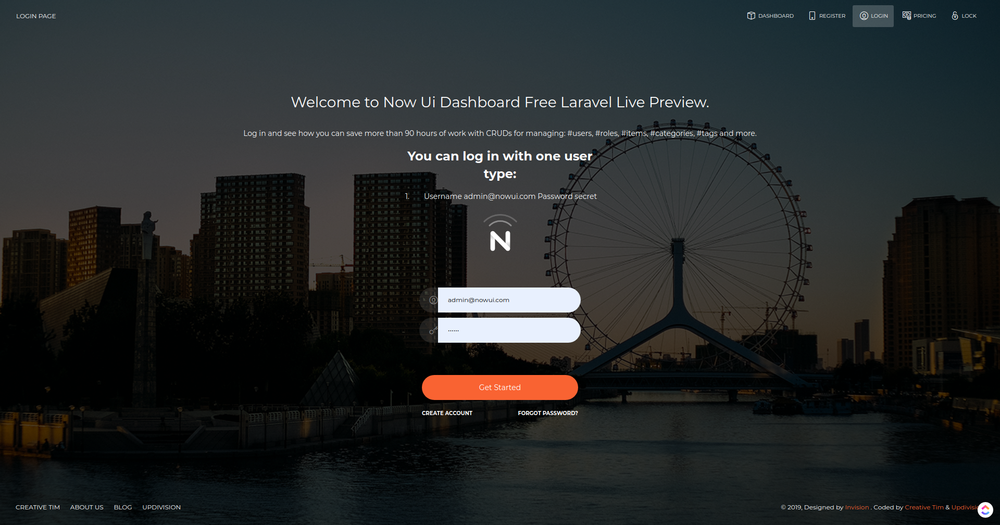

# [Now-ui Dashboard Laravel](https://www.creative-tim.com/live/now-ui-dashboard-laravel/?ref=ndl-readme) [](https://twitter.com/home?status=now-ui%20Dashboard%20Pro%20Laravel%E2%9D%A4%EF%B8%8F%0Ahttps%3A//now-ui-dashboard-laravel.creative-tim.com/%20%23%now-ui%20%23design%20%23dashboard%20%23laravel%20%23pro%20via%20%40CreativeTim)

  [](https://github.com/laravel-frontend-presets/now-ui-dashboard/issues?q=is%3Aopen+is%3Aissue) [](https://github.com/laravel-frontend-presets/now-ui-dashboard/issues?q=is%3Aissue+is%3Aclosed)

*Frontend version*: Now UI Dashboard v1.4.1. More info at https://www.creative-tim.com/product/now-ui-dashboard/?ref=ndl-readme


Speed up your web development with the Bootstrap 4 Admin Dashboard built for Laravel Framework 8.x and up.

## Prerequisites

If you don't already have an Apache local environment with PHP and MySQL, use one of the following links:

 - Windows: https://updivision.com/blog/post/beginner-s-guide-to-setting-up-your-local-development-environment-on-windows
 - Linux: https://howtoubuntu.org/how-to-install-lamp-on-ubuntu
 - Mac: https://wpshout.com/quick-guides/how-to-install-mamp-on-your-mac/

Also, you will need to install Composer: https://getcomposer.org/doc/00-intro.md

And Laravel: https://laravel.com/docs/8.x/installation

## Installation

After initializing a fresh instance of Laravel (and making all the necessary configurations), install the preset using one of the provided methods:

### Via composer

1. `Cd` to your Laravel app  
2. Type in your terminal: `composer require laravel/ui` and  `php artisan ui vue --auth`
3. Install this preset via `composer require laravel-frontend-presets/now-ui-dashboard`. No need to register the service provider. Laravel 5.5 & up can auto detect the package.
4. Run `php artisan ui nowui` command to install the NowUI preset. This will install all the necessary assets and also the custom auth views, it will also add the auth route in `routes/web.php`
(NOTE: If you run this command several times, be sure to clean up the duplicate Auth entries in routes/web.php)
5. In your terminal run `composer dump-autoload`
6. Run `php artisan migrate --seed` to create basic users table

### By using the archive

1. In your application's root create a **presets** folder
2. [Download an archive](https://github.com/laravel-frontend-presets/now-ui-dashboard/archive/master.zip) of the repo and unzip it
3. Copy and paste **now-ui-master** folder in presets (created in step 2) and rename it to **NowUi**
4. Open `composer.json` file 
5. Add `"LaravelFrontendPresets\\NowUiPreset\\": "presets/NowUi/src"` to `autoload/psr-4` and to `autoload-dev/psr-4`
6. Add `LaravelFrontendPresets\NowUiPreset\NowUiPresetServiceProvider::class` to `config/app.php` file
7. Type in your terminal: `composer require laravel/ui` and  `php artisan ui vue --auth`
8. In your terminal run `composer dump-autoload`
9. Run `php artisan ui nowui` command to install the NowUI preset. This will install all the necessary assets and also the custom auth views, it will also add the auth route in `routes/web.php`
(NOTE: If you run this command several times, be sure to clean up the duplicate Auth entries in routes/web.php)
10. Run `php artisan migrate --seed` to create basic users table

## Usage

To start testing the theme, register as a user or log in using one of the default users: 

- admin type - **admin@nowui.com** with the password **secret**

Make sure to run the migrations and seeders for the above credentials to be available.

In addition to the features included in the free preset, the Pro theme also has a role management example with an updated user management, as well as tag management, category management and item management examples. All the necessary files (controllers, requests, views) are installed out of the box and all the needed routes are added to `routes/web.php`. Keep in mind that all the features can be viewed once you log in using the credentials provided above or by registering your own user. 

### Dashboard

You can access the dashboard either by using the "**Dashboards/Dashboard**" link in the left sidebar or by adding **/home** in the URL.

### Profile edit

You have the option to edit the current logged in user's profile information (name, email, profile picture) and password. To access this page, just click the "**Examples/Profile**" link in the left sidebar or add **/profile** in the URL.

The `App\Http\Controllers\ProfileController` handles the update of the user information and password.

```
public function update(ProfileRequest $request)
    {
        auth()->user()->update(
            $request->merge(['picture' => $request->photo ? $request->photo->store('profile', 'public') : null])
                ->except([$request->hasFile('photo') ? '' : 'picture'])
        );

        return back()->withStatus(__('Profile successfully updated.'));
    }

/**
* Change the password
*
* @param  \App\Http\Requests\PasswordRequest  $request
* @return \Illuminate\Http\RedirectResponse
*/
public function password(PasswordRequest $request)
{
    auth()->user()->update(['password' => Hash::make($request->get('password'))]);

    return back()->withStatus(__('Password successfully updated.'));
}
```

If you input the wrong data when editing the profile, don't worry. Validation rules have been added to prevent this (see `App\Http\Requests\ProfileRequest`). If you try to change the password, you will see that additional validation rules have been added in `App\Http\Requests\PasswordRequest`. You also have  a custom validation rule that can be found in `App\Rules\CurrentPasswordCheckRule`.

```
public function rules()
{
    return [
        'old_password' => ['required', 'min:6', new CurrentPasswordCheckRule],
        'password' => ['required', 'min:6', 'confirmed', 'different:old_password'],
        'password_confirmation' => ['required', 'min:6'],
    ];
}
```
## Table of Contents

* [Versions](#versions)
* [Demo](#demo)
* [Documentation](#documentation)
* [File Structure](#file-structure)
* [Browser Support](#browser-support)
* [Resources](#resources)
* [Reporting Issues](#reporting-issues)
* [Licensing](#licensing)
* [Useful Links](#useful-links)

## Versions

[](https://demos.creative-tim.com/argon-dashboard-pro/pages/dashboards/dashboard.html?ref=ndl-readme)
[](https://argon-dashboard-laravel.creative-tim.com/?ref=ndl-readme)

| HTML | LARAVEL |
| --- | --- |
| [](https://demos.creative-tim.com/now-ui-dashboard/examples/dashboard.html?ref=ndl-readme) | [](https://www.creative-tim.com/live/now-ui-dashboard-laravel/?ref=ndl-readme)

## Demo

| Login | Dashboard |
| --- | --- |
[](https://now-ui-dashboard-laravel.creative-tim.com/login?ref=ndl-readme)  | [](https://now-ui-dashboard-laravel.creative-tim.com/?ref=ndl-readme)

| Profile Page | Users Page |
| --- | --- |
| [](https://now-ui-dashboard-laravel.creative-tim.com/profile?ref=ndl-readme)  | [](https://now-ui-dashboard-laravel.creative-tim.com/user?ref=ndl-readme)
[View More](https://www.creative-tim.com/live/now-ui-dashboard-laravel/?ref=ndl-readme)

## Documentation
The documentation for the now-ui Dashboard Laravel is hosted at our [website](https://www.creative-tim.com/live/now-ui-dashboard-laravel/?start-page=/docs/getting-started/laravel-setup.html&ref=ndl-readme).

## File Structure
```
├── changelog.md
├── composer.json
├── docs
│   └── documentation.html
├── .git
│   ├── branches
│   ├── COMMIT_EDITMSG
│   ├── config
│   ├── description
│   ├── HEAD
│   ├── hooks
│   │   ├── applypatch-msg.sample
│   │   ├── commit-msg.sample
│   │   ├── fsmonitor-watchman.sample
│   │   ├── post-update.sample
│   │   ├── pre-applypatch.sample
│   │   ├── pre-commit.sample
│   │   ├── prepare-commit-msg.sample
│   │   ├── pre-push.sample
│   │   ├── pre-rebase.sample
│   │   ├── pre-receive.sample
│   │   └── update.sample
│   ├── index
│   ├── info
│   │   └── exclude
│   ├── logs
│   │   ├── HEAD
│   │   └── refs
│   │       ├── heads
│   │       │   ├── develop
│   │       │   └── master
│   │       └── remotes
│   │           └── origin
│   │               └── develop
│   ├── objects
│   └── refs
│       ├── heads
│       │   ├── develop
│       │   └── master
│       ├── remotes
│       │   └── origin
│       │       └── develop
│       └── tags
├── license.md
├── README.md
├── screens
│   ├── Dashboard.png
│   ├── login.png
│   ├── Profile.png
│   └── Users.png
├── src
│   ├── NowUiPreset.php
│   ├── NowUIPresetServiceProvider.php
│   └── now-ui-stubs
│       ├── app
│       │   ├── Console
│       │   │   ├── comments
│       │   │   │   └── DeleteOldUsers.php
│       │   │   └── Kernel.php
│       │   ├── Exceptions
│       │   │   └── Handler.php
│       │   ├── Http
│       │   │   ├── Controllers
│       │   │   │   ├── Auth
│       │   │   │   │   ├── ForgotPasswordController.php
│       │   │   │   │   ├── LoginController.php
│       │   │   │   │   ├── RegisterController.php
│       │   │   │   │   ├── ResetPasswordController.php
│       │   │   │   │   └── VerificationController.php
│       │   │   │   ├── Controller.php
│       │   │   │   ├── HomeController.php
│       │   │   │   ├── PageController.php
│       │   │   │   ├── ProfileController.php
│       │   │   │   └── UserController.php
│       │   │   ├── Kernel.php
│       │   │   ├── Middleware
│       │   │   │   ├── Authenticate.php
│       │   │   │   ├── CheckForMaintenanceMode.php
│       │   │   │   ├── EncryptCookies.php
│       │   │   │   ├── RedirectIfAuthenticated.php
│       │   │   │   ├── TrimStrings.php
│       │   │   │   ├── TrustProxies.php
│       │   │   │   └── VerifyCsrfToken.php
│       │   │   └── Requests
│       │   │       ├── CategoryRequest.php
│       │   │       ├── ItemRequest.php
│       │   │       ├── PasswordRequest.php
│       │   │       ├── ProfileRequest.php
│       │   │       ├── TagRequest.php
│       │   │       └── UserRequest.php
│       │   ├── Observers
│       │   │   └── UserObserver.php
│       │   ├── Policies
│       │   │   └── UserPolicy.php
│       │   ├── Providers
│       │   │   ├── AppServiceProvider.php
│       │   │   ├── AuthServiceProvider.php
│       │   │   ├── BroadcastServiceProvider.php
│       │   │   ├── EventServiceProvider.php
│       │   │   └── RouteServiceProvider.php
│       │   ├── Rules
│       │   │   └── CurrentPasswordCheckRule.php
│       │   └── User.php
│       ├── database
│       │   ├── factories
│       │   │   └── UserFactory.php
│       │   ├── .gitignore
│       │   ├── migrations
│       │   │   ├── 2014_10_12_100000_create_password_resets_table.php
│       │   │   └── 2019_01_15_110000_create_users_table.php
│       │   └── seeds
│       │       ├── DatabaseSeeder.php
│       │       └── UsersTableSeeder.php
│       └── resources
│           ├── assets
│           │   ├── css
│           │   │   ├── bootstrap.min.css
│           │   │   ├── bootstrap.min.css.map
│           │   │   ├── now-ui-dashboard.css
│           │   │   ├── now-ui-dashboard.css.map
│           │   │   └── now-ui-dashboard.min.css
│           │   ├── demo
│           │   │   ├── demo.css
│           │   │   └── demo.js
│           │   ├── fonts
│           │   │   ├── nucleo-license.md
│           │   │   ├── nucleo-outline.eot
│           │   │   ├── nucleo-outline.ttf
│           │   │   ├── nucleo-outline.woff
│           │   │   └── nucleo-outline.woff2
│           │   ├── img
│           │   │   ├── apple-icon.png
│           │   │   ├── bg14.jpg
│           │   │   ├── bg16.jpg
│           │   │   ├── bg5.jpg
│           │   │   ├── default-avatar.png
│           │   │   ├── favicon.png
│           │   │   ├── header.jpg
│           │   │   ├── mike.jpg
│           │   │   ├── now-logo.png
│           │   │   └── now-ui-dashboard.gif
│           │   ├── js
│           │   │   ├── core
│           │   │   │   ├── bootstrap.min.js
│           │   │   │   ├── jquery.min.js
│           │   │   │   └── popper.min.js
│           │   │   ├── now-ui-dashboard.js
│           │   │   ├── now-ui-dashboard.js.map
│           │   │   ├── now-ui-dashboard.min.js
│           │   │   └── plugins
│           │   │       ├── bootstrap-notify.js
│           │   │       ├── chartjs.min.js
│           │   │       └── perfect-scrollbar.jquery.min.js
│           │   └── scss
│           │       ├── now-ui-dashboard
│           │       │   ├── _alerts.scss
│           │       │   ├── _buttons.scss
│           │       │   ├── cards
│           │       │   │   ├── _card-chart.scss
│           │       │   │   ├── _card-map.scss
│           │       │   │   ├── _card-plain.scss
│           │       │   │   └── _card-user.scss
│           │       │   ├── _cards.scss
│           │       │   ├── _checkboxes-radio.scss
│           │       │   ├── _dropdown.scss
│           │       │   ├── _fixed-plugin.scss
│           │       │   ├── _footers.scss
│           │       │   ├── _images.scss
│           │       │   ├── _inputs.scss
│           │       │   ├── _misc.scss
│           │       │   ├── mixins
│           │       │   │   ├── _buttons.scss
│           │       │   │   ├── _cards.scss
│           │       │   │   ├── _dropdown.scss
│           │       │   │   ├── _inputs.scss
│           │       │   │   ├── _page-header.scss
│           │       │   │   ├── _sidebar.scss
│           │       │   │   ├── _transparency.scss
│           │       │   │   └── _vendor-prefixes.scss
│           │       │   ├── _mixins.scss
│           │       │   ├── _navbar.scss
│           │       │   ├── _nucleo-outline.scss
│           │       │   ├── _page-header.scss
│           │       │   ├── plugins
│           │       │   │   ├── _plugin-animate-bootstrap-notify.scss
│           │       │   │   └── _plugin-perfect-scrollbar.scss
│           │       │   ├── _responsive.scss
│           │       │   ├── _sidebar-and-main-panel.scss
│           │       │   ├── _tables.scss
│           │       │   ├── _typography.scss
│           │       │   └── _variables.scss
│           │       └── now-ui-dashboard.scss
│           ├── js
│           │   ├── app.js
│           │   ├── bootstrap.js
│           │   └── components
│           │       └── ExampleComponent.vue
│           ├── lang
│           │   └── en
│           │       ├── auth.php
│           │       ├── pagination.php
│           │       ├── passwords.php
│           │       └── validation.php
│           ├── sass
│           │   ├── app.scss
│           │   └── _variables.scss
│           └── views
│               ├── alerts
│               │   ├── errors.blade.php
│               │   ├── error_self_update.blade.php
│               │   ├── feedback.blade.php
│               │   ├── migrations_check.blade.php
│               │   └── success.blade.php
│               ├── auth
│               │   ├── login.blade.php
│               │   ├── passwords
│               │   │   ├── email.blade.php
│               │   │   └── reset.blade.php
│               │   ├── register.blade.php
│               │   └── verify.blade.php
│               ├── home.blade.php
│               ├── layouts
│               │   ├── app.blade.php
│               │   ├── footer.blade.php
│               │   ├── navbars
│               │   │   ├── navs
│               │   │   │   ├── auth.blade.php
│               │   │   │   └── guest.blade.php
│               │   │   └── sidebar.blade.php
│               │   └── page_template
│               │       ├── auth.blade.php
│               │       └── guest.blade.php
│               ├── pages
│               │   ├── icons.blade.php
│               │   ├── maps.blade.php
│               │   ├── notifications.blade.php
│               │   ├── table.blade.php
│               │   ├── typography.blade.php
│               │   └── upgrade.blade.php
│               ├── profile
│               │   └── edit.blade.php
│               ├── users
│               │   └── index.blade.php
│               └── welcome.blade.php
└── .vscode
    └── settings.json
```
## Browser Support

At present, we officially aim to support the last two versions of the following browsers:

    


## Resources
- Demo: <https://www.creative-tim.com/live/now-ui-dashboard-laravel/?ref=ndl-readme>
- Download Page: <https://www.creative-tim.com/product/now-ui-dashboard-laravel?ref=ndl-readme>
- Documentation: <https://www.creative-tim.com/live/now-ui-dashboard-laravel/?start-page=/docs/getting-started/laravel-setup.html&ref=ndl-readme>
- License Agreement: <https://www.creative-tim.com/license?ref=ndl-readme>
- Support: <https://www.creative-tim.com/contact-us?ref=ndl-readme>
- Issues: [Github Issues Page](https://github.com/creativetimofficial/now-ui-dashboard-laravel/issues)
- **Dashboards:**

| HTML | LARAVEL |
| --- | --- |
| [](https://demos.creative-tim.com/now-ui-dashboard/examples/dashboard.html?ref=ndl-readme) | [](https://www.creative-tim.com/live/now-ui-dashboard-laravel/?ref=ndl-readme)

## Change log

Please see the [changelog](CHANGELOG.md) for more information on what has changed recently.

## Credits

- [Creative Tim](https://creative-tim.com/?ref=ndl-readme)
- [UPDIVISION](https://updivision.com)

## Reporting Issues

We use GitHub Issues as the official bug tracker for the now-ui Dashboard Laravel. Here are some advices for our users that want to report an issue:

1. Make sure that you are using the latest version of the now-ui Dashboard Laravel. Check the CHANGELOG from your dashboard on our [website](https://www.creative-tim.com/?ref=ndl-readme).
2. Providing us reproducible steps for the issue will shorten the time it takes for it to be fixed.
3. Some issues may be browser specific, so specifying in what browser you encountered the issue might help.

## Licensing

- Copyright 2019 Creative Tim (https://www.creative-tim.com/?ref=ndl-readme)
- [Creative Tim License](https://www.creative-tim.com/license?ref=ndl-readme).


## Useful Links

- [Tutorials](https://www.youtube.com/channel/UCVyTG4sCw-rOvB9oHkzZD1w?ref=ndl-readme)
- [Affiliate Program](https://www.creative-tim.com/affiliates/new?ref=ndl-readme) (earn money)
- [Blog Creative Tim](http://blog.creative-tim.com/?ref=ndl-readme)
- [Free Products](https://www.creative-tim.com/bootstrap-themes/free?ref=ndl-readme) from Creative Tim
- [Premium Products](https://www.creative-tim.com/bootstrap-themes/premium?ref=ndl-readme) from Creative Tim
- [React Products](https://www.creative-tim.com/bootstrap-themes/react-themes?ref=ndl-readme) from Creative Tim
- [Angular Products](https://www.creative-tim.com/bootstrap-themes/angular-themes?ref=ndl-readme) from Creative Tim
- [VueJS Products](https://www.creative-tim.com/bootstrap-themes/vuejs-themes?ref=ndl-readme) from Creative Tim
- [More products](https://www.creative-tim.com/bootstrap-themes?ref=ndl-readme) from Creative Tim
- Check our Bundles [here](https://www.creative-tim.com/bundles??ref=ndl-readme)

## Social Media

### Creative Tim:

Twitter: <https://twitter.com/CreativeTim?ref=ndl-readme>

Facebook: <https://www.facebook.com/CreativeTim?ref=ndl-readme>

Dribbble: <https://dribbble.com/creativetim?ref=ndl-readme>

Instagram: <https://www.instagram.com/CreativeTimOfficial?ref=ndl-readme>


### Updivision:

Twitter: <https://twitter.com/updivision?ref=ndl-readme>

Facebook: <https://www.facebook.com/updivision?ref=ndl-readme>

Linkedin: <https://www.linkedin.com/company/updivision?ref=ndl-readme>

Updivision Blog: <https://updivision.com/blog/?ref=ndl-readme>

## Credits

- [Creative Tim](https://creative-tim.com/?ref=ndl-readme)
- [UPDIVISION](https://updivision.com)
